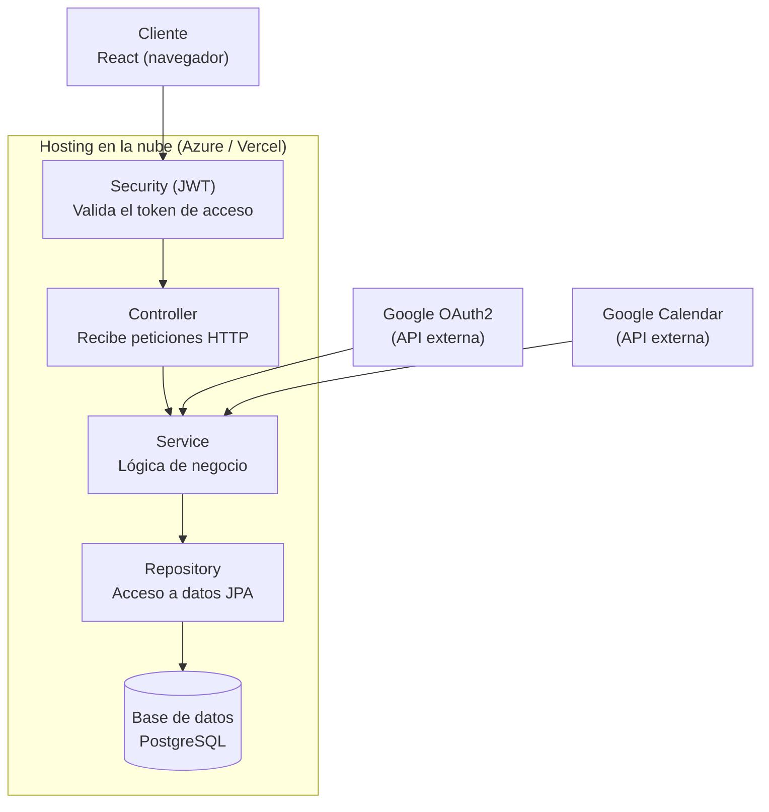

# VALORIA — Arquitectura general

## Leyenda

- **Gris** (actores externos, fuera de la infraestructura): Cliente React y las APIs de Google
  (OAuth2, Calendar).
- **Verde** (todo lo desplegado en la nube): Microsoft Azure, o Vercel para el frontend si se
  decide así.
- **Azul** (las 4 capas del backend):
  1. **Security (JWT)** — filtro que valida el token *antes* de que la petición llegue al
     Controller. Si el token no es válido, la petición ni siquiera llega a la lógica de
     negocio.
  2. **Controller** — recibe las peticiones HTTP.
  3. **Service** — lógica de negocio (cálculo de XP, daño a jefes, etc.).
  4. **Repository** — acceso a datos vía JPA.
- **Rojo**: la base de datos PostgreSQL, corriendo también dentro de Azure (Azure Database for
  PostgreSQL).

## Notas

- Regla de flujo estricta: `Cliente → Security (JWT) → Controller → Service → Repository →
  PostgreSQL`. El Controller nunca toca el Repository directamente.
- `GoogleCalendarService` (dentro de la capa Service) es el único componente que, además de
  hablar con la base de datos, habla con una API externa (Google Calendar) — igual que el
  `AuthService` habla con Google OAuth2 para el login.
- **Decisión tomada**: el frontend se despliega en **Vercel**, no en Azure Static Web Apps.
  El backend (Spring Boot) y la base de datos (PostgreSQL) siguen en Azure App Service / Azure
  Database for PostgreSQL. Esto implica configurar CORS en el backend para aceptar el dominio
  de Vercel, y las variables de entorno del frontend deben apuntar a la URL pública del backend
  en Azure.
