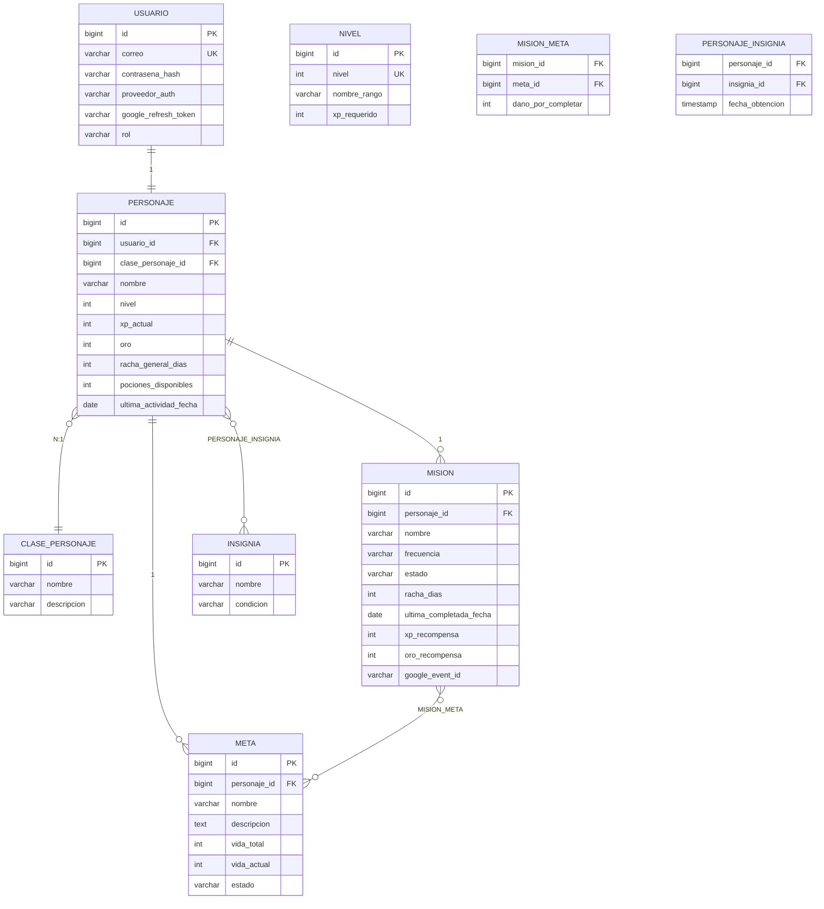

# VALORIA — Modelo de datos (ERD)

> Fuentes originales: [`VALORIA_modelo_ER.drawio`](VALORIA_modelo_ER.drawio) y
> [`valoria_erd_actualizado.html`](valoria_erd_actualizado.html). Este archivo es una
> transcripción en Mermaid para lectura rápida — el drawio es la fuente editable.

## Puntos clave del diseño

- `USUARIO` 1:1 `PERSONAJE` — un personaje por usuario.
- `CLASE_PERSONAJE` y `NIVEL` son **catálogos propios desde el inicio** (decisión tomada), no
  texto libre — el admin los gestiona sin tocar código vía `/admin/clases` y `/admin/niveles`.
  `PERSONAJE.clase_personaje_id` es FK a `CLASE_PERSONAJE`. La tabla `NIVEL` guarda
  `nombre_rango` y `xp_requerido` por nivel, aunque el cálculo de XP se hace por fórmula (ver
  regla en `requisitos.md`) — la tabla sirve para cachear el valor y para nombres de rango
  personalizados.
- `PERSONAJE` 1:N `MISION` y 1:N `META`.
- `MISION` N:N `META` vía tabla intermedia `MISION_META` (campo `dano_por_completar`, con valor
  fijo según la frecuencia de la misión — ver regla de negocio en `requisitos.md`).
- `PERSONAJE` N:N `INSIGNIA` vía tabla intermedia `PERSONAJE_INSIGNIA`.
- `MISION.google_event_id` — agregado al modelo para guardar el ID del evento de Calendar
  vinculado (permite editarlo/eliminarlo desde la app).
- `PERSONAJE.pociones_disponibles` — agregado al modelo para el sistema de poción (HU-15); se
  incrementa cada 7 días de `racha_general_dias`.
- `PERSONAJE.racha_general_dias` es la racha "oficial" mostrada en la hoja de personaje;
  `MISION.racha_dias` es la racha individual por misión (para HU-13/HU-14 a nivel de cada
  hábito). Ambas coexisten con propósitos distintos.
- Buenas prácticas pendientes de aplicar en el script SQL: `estado`/`frecuencia` como ENUM o
  CHECK, columnas `created_at`/`updated_at` en todas las tablas, restricción de unicidad en
  `MISION_META` (mision_id+meta_id) y `PERSONAJE_INSIGNIA` (personaje_id+insignia_id).
